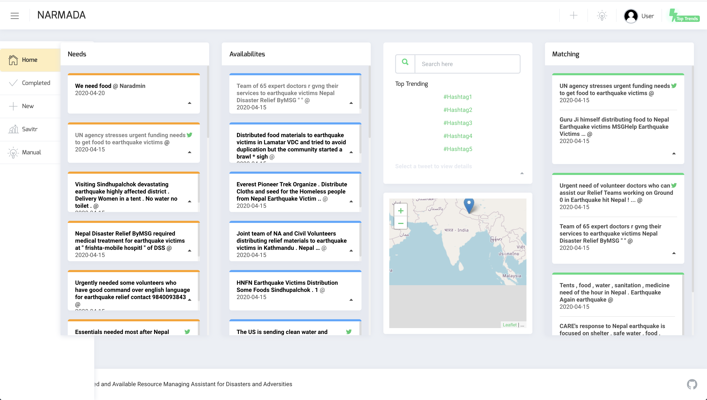
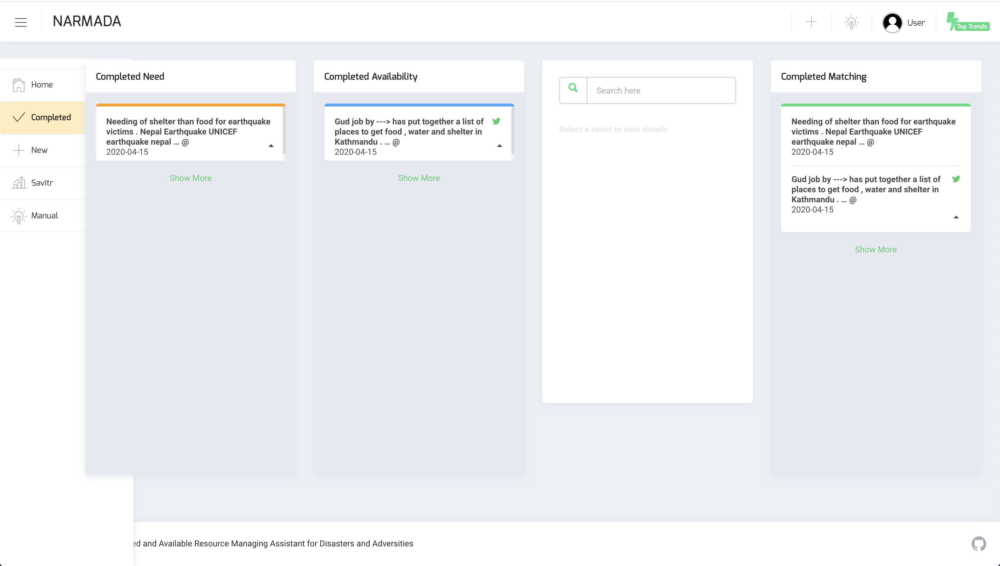
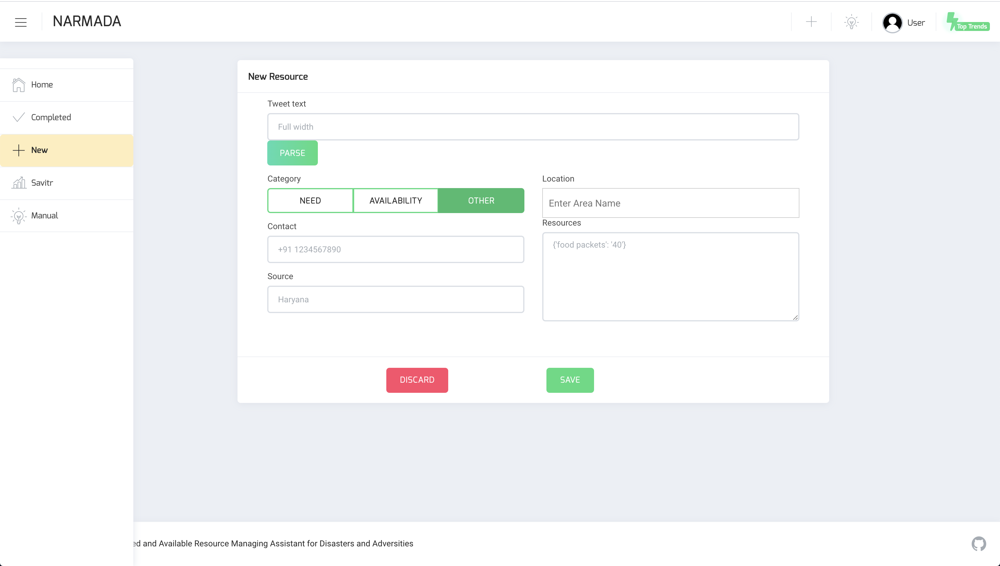
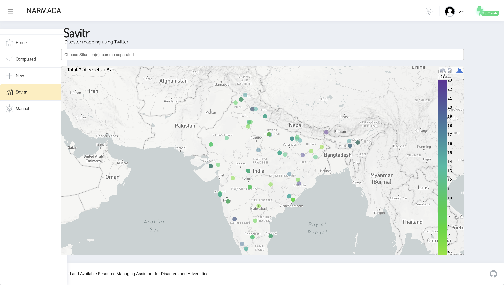
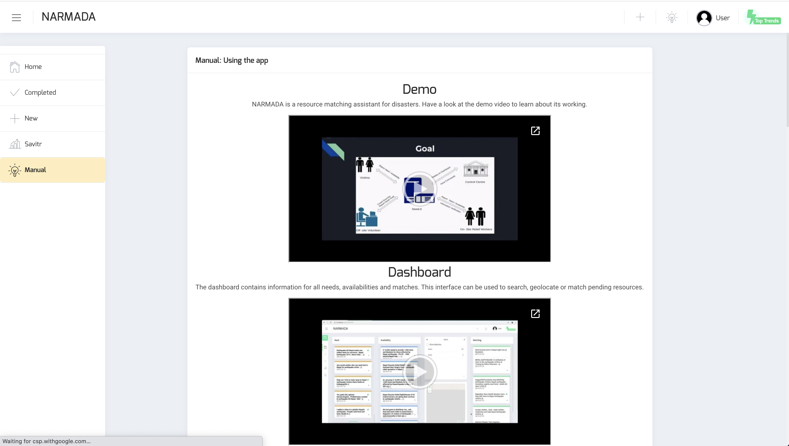

# Contents
- [Project Description](#project-description)
- [Citation](#citation)
- [System Description](#system-description)
  - [Dashboard](#dashboard)
  - [Completed matches](#completed-matches)
  - [New information](#new-information)
  - [Tweet traffic](#tweet-traffic)
  - [Manual](#manual)
- [API Description](#api-description)
- [Contact information](#contact-information)

# Project Description

During a disaster event, two types of information that are especially useful for coordinating relief operations are needs and availability of resources (e.g., food, water, medicines) in the affected region. Information posted on micro-blogging sites such as Twitter is increasingly being used to assist such post-disaster relief operations. The two major practical challenges faced in this regard are 

* to identify tweets that inform about resource needs and availabilities (termed as need-tweets and availability-tweets respectively), and 
* to automatically match needs with appropriate availabilities. 

Our project deals with the second challenge wherein we develop a methodology to understand five important aspects of need-tweets and availability-tweets, including
- what resource and what quantity is needed/available,
- the geographical location of the need/availability,
- who needs / is providing the resource.

We leverage not only the common resources mentioned in the needs and availabilities but also the geographical proximity of the locations to provide a real-time and practical solution to the matching problem. 

We propose **Narmada (Need and Available Resource Managing Assistant for Disasters and Adversities)**, a “semi-automated system” developed on the aforementioned proposed methodology. The main objective of our project is to assist and facilitate the coordination of post-disaster relief operations. It achieves thus by automating the task of extracting resources and other vital information from micro-blogs and subsequently matching the potential needs and availabilities. However, the final decision of resource matching lies with the sys-admin. 

Narmada simply displays possible matches by considering any combination of resource similarity, location proximity and temporal relevance. The administrative control has the sole authority to choose a valid match as the situation deems necessary. This enables us to account for unforeseen events which are known only to the higher authorities and justifies the semi-automated approach proposed here.

Similarly, Narmada enables off-site volunteers to verify the information extracted and permits them to make the necessary modifications. It is crucial since the methodology might not account for covert information or certain details due to the convoluted manner in which tweets are written. This necessitates manual intervention in the form of editing extracted information or adding new information. The provision of manually inserting new information enables Narmada to incorporate information from varied sources like phone calls, SMS, Facebook posts and the like in addition to Twitter stream.

Narmada has other additional features, such as visualising the relevant information on a map-based interface, searching specific information between the need and available tweets and manually assigning the status of a need or availability (new, verified, assigned or completed). The system is designed to have different authentication levels such as modification and insertion of resources is permitted by remote offsite-volunteers, matching a relevant need and availability is determined by the administrator, assigning status is governed by on-site volunteers and administrator while the system is view-able by everyone. 

With Narmada, we hope to make disaster mitigation much easier by assisting volunteers in their relief coordination efforts. 

# Citation

If you use the codes, please cite the following paper:
```
 @inproceedings{hiware-socialnlp20,
   author = {Hiware, Kaustubh and Dutt, Ritam and Sinha, Sayan and Patro, Sohan and Ghosh, Kripabandhu and Ghosh, Saptarshi},
   title = {NARMADA: Need and Available Resource Managing Assistant for Disasters and Adversities},
   booktitle = {Proceedings of ACL Workshop on Natural Language Processing for Social Media (SocialNLP)},
   year = {2020}
  }
```

# System Description

The user interface has been designed in Typescript using Angular. [ngx-admin](https://github.com/akveo/ngx-admin) was used as a boilerplate forfront-end components. The interface has been designed to be intuitive, yet presenting as much information as possible without overcrowding.

The userinterface has five components:

## Dashboard



The dashboard provides a preliminary view of unmatched needs and availabilities. Since the dashboard serves as the landing page, several functionalities are supported:

* It can view the currently active needs, avail-abilities and matched resourcesin separate tabs. It also mentions details pertaining to a tweet like text, date, and tweet URL. Such information is available on the card layout. To facilitate a comfortable view, other details like contact, location and source have been mentioned on the flipside of the card.

* Search as a feature has been provided in the interface. Since a huge volume of tweets wouldbe received per hour, it might not be possible tomanually scroll and find results relevant to a certain keyword. An in-built search feature, as seen in Fig2 (b), when filled in, allows the viewers to query needs, availabilites and matched resources, all in one go.

* The interface displays th ematches corresponding to need and availabilities. The primary motivation for showing them in separate columns is that it allows one to view needs and matching availabilities (also vice versa) in the same screen. Clicking on a need resource reveals matching availabilites by default(as well as highlights the selected resource). The search tab is remodelled to show resource fields for the specific resource, alongwith an option to show potential matches (both positive and negative). Since we aim to build a semi-autonomous system, the sys-admin (or some volunteer) has to manually match/assign a need toan appropriate resource. Once a matching availability is selected, a match is made and appears in theMatching column.

* Once a match is made, assigned and completed by a volunteer, the match can be marked completed. Completed matches, needs and availabilities are explained in the next subsection.

* A map is provided right below the searchtab, that highlights the location the resource hasbeen reported from, which assists ingeolocatingresources. However, due to proprietary third-party services being rate limited, this might not always yield accurate locations.

## Completed matches



This section of the interface acts as a logger to track completed or exhausted matches. It shares the same layout as the dashboard, apart from the presence of a search feature.

## New information



This view allows manual entry of details for a new need or availability. The information is automatically extracted but can be edited if required. The user is expected to enter text and click the parse button. The system attempts to identify relevant attributes from the text provided automatically. It is possible that the text is detected as neither a resource nor an availability, in the event of which manually a classification assignment must be made. If the information parsed (and edited as deemed required) seems accurate, the new resource can be saved. The newly added tweet then shows up in the dashboard.

## Tweet traffic



Apart from actionable items, users may be interested in the overall tweet activity about a particular disaster / word / phrase. For this, we integrate the view of Savitr [citation](https://dl.acm.org/doi/abs/10.1145/3184558.3191623), which tracks Twitter activity related to any disasters on a day-to-day basis.

## Manual



To allow users to view a sizeable amount of information at once, we understand it is possible to find the system complicated. Short, handy videos are available in order to explain the functionality for each of the prior components, along with a mission statement for the project.

# API Description

The server side uses NodeJS framework and is written in Javascript. Nginx is used as an HTTP server to make the frontend accessible to the public. However, the NLP-related extraction tasks are handled better in Python. So a part of the server-side has been hosted with Flask, a micro web framework in Python. The Flask server makes API calls to the deep learning classifiers, featuring BERT, which returns the output. The output is further reflected in the frontend. The server sends information requested by the user interface via _RESTful API_, which supports cached responses on the frontend and enables the system to be scalable, thus allowing more users to use this service.

API endpoints are publicly available, which would allow programmatic access to the server's functionalities. The code repository for this can be found at https://github.com/OSM-DM-KGP/Narmada-server. The major endpoints provided are:

* **Fetching information** i.e. needs, availabilites and matches. Filtering by multiple conditions (such as matched or not, containing a particular resource) is also possible.

    ```
    GET /get?type=Need&isCompleted=false

    isCompleted: false / true {Completed already or not}
    skip: Skips first x results (int, default=0)
    text: Resource must contain this text (default absent)
    type: Need / Availability

    Response: array of jsons
    ```

* **Matching needs and availabilities** For a provided need / availability, top 20 matches are suggested based on resource similarity.

    ```
    GET /match?type=Need&id=591987020924260354

    id: id of resource that needs to be matched
    type: type of current resource that seeks matches

    Response: array of jsons
    ```

* **Elevating matched status** -- Whenever a suitable match is found for a need/ availability, the corresponding pair is marked as _Matched_, implying these cannot be matched again. Once the Match has been assigned to a volunteer, and is completed, the sys-admin can mark this match as _Completed_, which moves both these resources from the dashboard to the Completed Resources view.

    ```
    PUT /makeMatch?id1=X&id2=Y
    id1, id2: ids of two items that should be matched
    Currently does not have server side validation

    PUT /markCompleted?id1=X&id2=Y
    id1, id2: ids of two items that should be matched
    Currently does not have server side validation

    Response: Status code 201
    ```

* **Parsing and adding new information** -- The system allows creation of new need/availability for a provided text. This is achieved by parsing all information - resources, contact, location, quantity and source from the said text and returning these fields.

    ```
    POST /parse?text=This is some text
    text: Tweet text that should be parsed

    Response: See request params for next call
    ```

    ```
    POST /new
    Params:
    { "lang": "en",
    "text": "Food as rice service",
    "Classification": "Need",
    "isCompleted": false,
    "Matched": -1,
    "Locations":
    { "Assam, India": { "lat": 26.0737044, "long": 83.18594580000001 } },
    "Resources": { "Food": "rice"},
    "Contact": { "Email": [], "Phone number": [] }
    }

    Response: Status code 201
    ```

# Contact information

If you wish to get in touch with the authors, please write to us at `hiwarekaustubh@gmail.com` & `ritam.dutt@gmail.com`.
